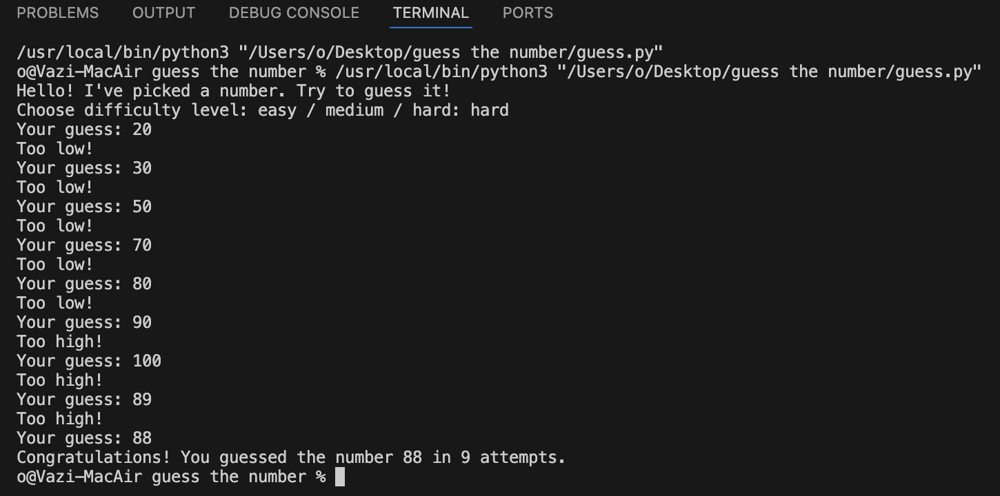

# 🎯 Guess the Number — Python Game with GUI & Sound

A simple but engaging number guessing game built with Python. Includes a clean GUI using `tkinter`, button styling with `ttk`, and sound effects via `pygame`.

## 📸 Screenshot


## 🔊 Features

- Clean, beginner-friendly interface (Tkinter + ttk)
- Random number guessing from 1 to 100
- Sound effects on success and failure (via Pygame)
- "Play Again" button
- Support for `.mp3` and `.wav`

## 🚀 How to Run

```bash
git clone https://github.com/vazisal/guess-the-number.git
cd guess-the-number
python3 guess_gui.py